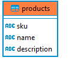
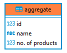

# Large File Processor

Application to run large Data Ingestion processes in a Distributed Fashion.

## Prerequisites

- Need [Docker Desktop](https://www.docker.com/products/docker-desktop) Installed on your  Machine and it should be Up and Running.
- [Java 8/11](https://jdk.java.net/archive/)
- Package Manager [Maven](https://maven.apache.org/download.cgi) to Build Jar with Dependencies.

## Steps to Run the Pipeline

I have added a shell script file with all the  necessary commands in sequence to execute the Pipeline.

```bash
./run.sh
```
Alternatively you can run manually by running these commands in sequence,

```bash
mvn clean package

docker build -t data-processor:latest .

docker-compose up
```
## Technology Stack
- [Java 11](https://jdk.java.net/archive/) as Programming Language.
- [Apache Spark 3.1.1]() Framework to leverage Distributed Computing.
- [Postgres](https://www.postgresql.org/download/) as Data Store.
## Database Schema


## Database Scripts
### Table Creation
Check if Exists else Create.
```sql
CREATE TABLE if not exists products sku varchar(255) NOT NULL,
            name varchar(70) NULL,
            description varchar(1024) NULL,
            CONSTRAINT products_pkey PRIMARY KEY (sku));

CREATE TABLE if not exists aggregate id serial NOT NULL,
            name varchar(70) UNIQUE NOT NULL,
            "no. of products" int4 NOT NULL,
            CONSTRAINT aggregate_pkey PRIMARY KEY (id, name));
```
### Table Upsertion

Insert, if Conflict then Update.

```sql
INSERT INTO products ("name", sku, description)
            VALUES (?, ?, ?) ON CONFLICT (sku) DO UPDATE
            SET description = EXCLUDED.description, name = EXCLUDED.name;


INSERT INTO aggregate (name, "no. of products")
            VALUES (?, ?) ON CONFLICT (name) DO UPDATE
            SET "no. of products" = EXCLUDED."no. of products";
```
